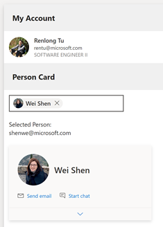

## Try This Demo App
1.	Make sure you’re using [TeamsFx VSCode extension  2.9.0](https://marketplace.visualstudio.com/items?itemName=TeamsDevApp.ms-teams-vscode-extension)
2.	Follow this doc to enable insider preview of our extension: [Enable Preview Features in Teams Toolkit](https://github.com/OfficeDev/TeamsFx/wiki/Enable-Preview-Features-in-Teams-Toolkit#vs-code-teams-toolkit)
4.	Open in VSCode and push F5 to local run the sample App

## Screenshot
